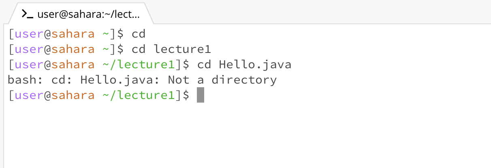

# Examples of using ~cd~

> With no arguments:

The working directory was ~ when the command was run
There was no output from the terminal as it did not have to change directories 
Thus I don't believe this was an error

> With a directory as an argument

The working directory was still ~ when the command was run
There was no output from the terminal as it simply changed its working directory to /lecture1
There was no error

> With a file as an argument

The working directory was /lecture1 when the command was run
The output says that the given argument is not a directory thus it cannot perform the command
This was an error as you cannot pass files as an argument for ~cd~

---

# Examples of using ~ls~

> With no arguments

The working directory was ~ when the command was run
The output was the list of the files and folders present in the current directory which was just /lecture1
There was no error as the output was what was expected

> With a directory as an argument

The working directory was ~ when the command was run
The output was the list of the files and folders present in the directory given as the argument
There was no error as the output was accurate

> With a file path as an argument

The working directory was ~ when the command was run
The output just gave back the file path to the file given as the argument
There was no error

---

# Examples of using ~cat~

> With no arguments

The working directory was ~ when the command was run
With no arguments given, the terminal allowed the user to type anything and printed it back
In order to exit this window, control+d had to be pressed
There was no error message however

> With a directory as an argument

The working directory was ~ when the command was run
The output simply gave an error saying /lecture1 is a directory and the cat command cannot be performed

> With a file path as an argument

The working directory was ~ when the command was run
The output printed out the contents of the given file
There was no error and the command did as expected

---
