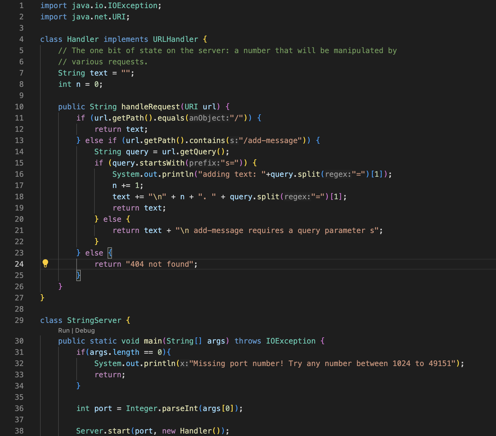
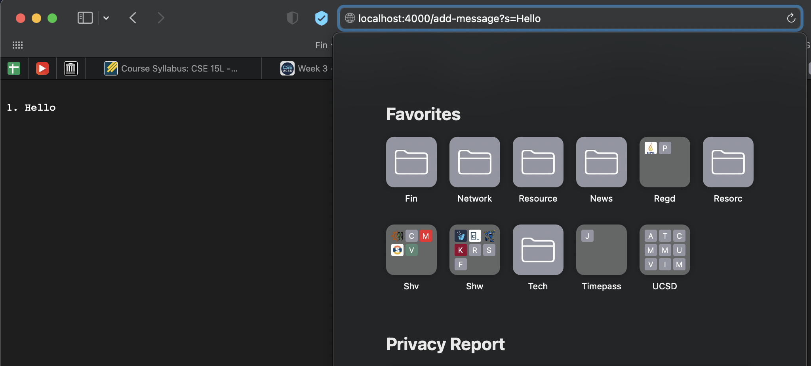
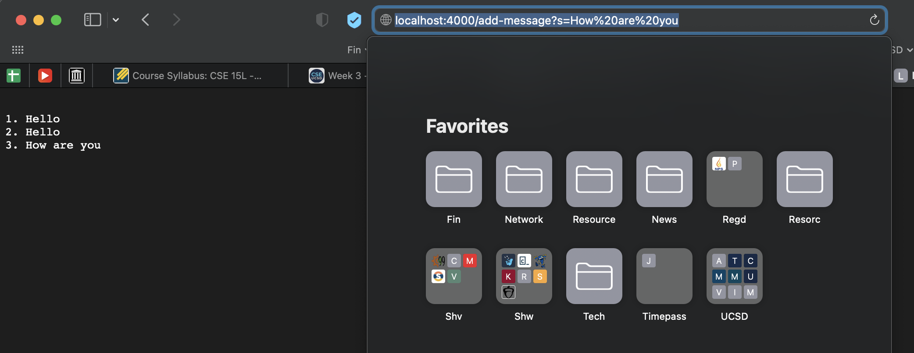
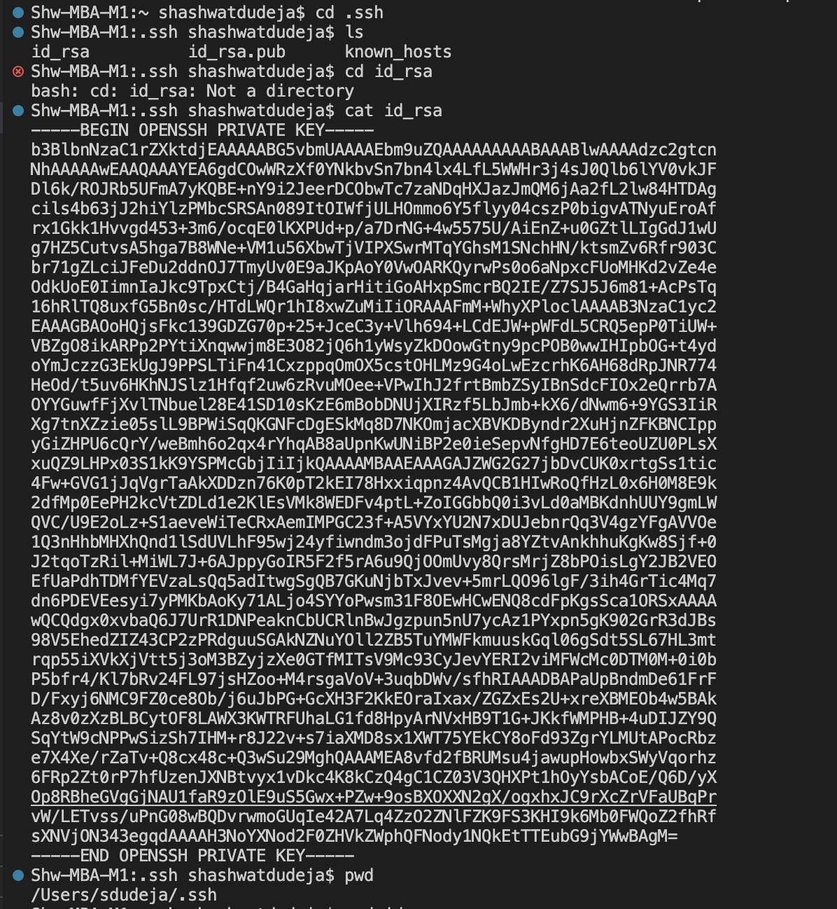
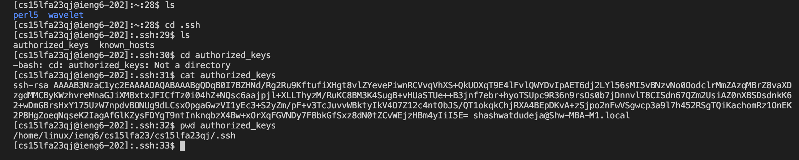
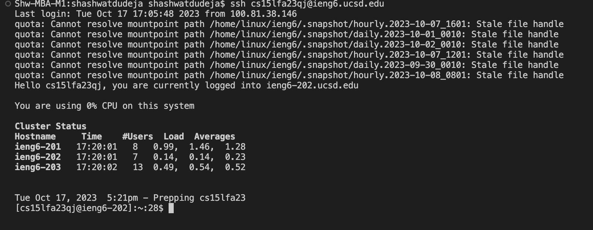

# Part 1

> Code for `StringServer.java`

> /add-message requests

The handleRequest method is called when the /add-message request is sent to the server with the entire url as the argument.
The method then checks whether the query is /add-message with a parameter of s and then adds the given string to the class variable `text` and increments the class variable `n` by 1.
Thus the site then shows the string added to the previous messages along with the incremented number.

---

# Part 2

>The path to the private key for my SSH key for logging into ieng6 on my local computer

>The path to the public key for my SSH key for logging into ieng6 within my ieng6 account

>The set up ssh keys now allow me to login to my ieng6 account without asking for my password

---

# Part 3

Learning about secureshell and how to remotely access another computer from our own was very fascinating and intriguing. 
Learning how to launch a web server was also very enjoyable. 
Practing these topics in lab was fun and gave me helpful experience with these new topics. 
