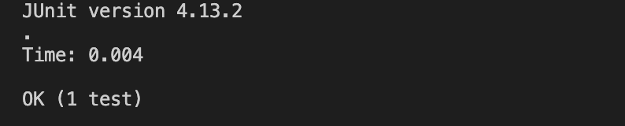

---
# Lab Report 3: Bugs and Commands
---

# Part 1: Bugs

> Function in question

```  
// should change the input array to be in reversed order
static void reverseInPlace(int[] arr) {
    for(int i = 0; i < arr.length; i += 1) {
        arr[i] = arr[arr.length - i - 1];
    }
}
```

> Failure-inducing input

```
@Test 
public void testReverseInPlace() {
    int[] input1 = {1, 2, 3, 4, 5};
    ArrayExamples.reverseInPlace(input1);
    assertArrayEquals(new int[]{5, 4, 3, 2, 1}, input1);
}
```

> Non failure-inducing input

```
@Test 
public void testReverseInPlace() {
    int[] input1 = { 3 };
    ArrayExamples.reverseInPlace(input1);
    assertArrayEquals(new int[]{ 3 }, input1);
}
```

> Symptom





> Bug

```
static void reverseInPlace(int[] arr) {
    for(int i = 0; i < arr.length; i += 1) {
        arr[i] = arr[arr.length - i - 1];
    }
}
```

```
static void reverseInPlace(int[] arr) {
    int p;
    for(int i = 0; i < arr.length/2; i += 1) {
        p = arr[i];
        arr[i] = arr[arr.length - i - 1];
        arr[arr.length - i - 1] = p;
    }
}
```

The approach in the original function was incorrect as it couldn't replace the values of the second half of the array with the ones from the first half.
We require a placeholder variable to hold the value of the elements in the first half in order to swap the values of both halves of the array.
The second correct function only loops through half of the array and uses the placeholder variable to swap all the values resulting in a working function which reverses an array.


---

# Part 2: Researching commands

`less` is a command which allows backward movement in the file as well as forward movement.  Also, less does not have to
read the entire input file before starting, so with large input files it starts up faster than other text editors.

> 4 interesting options with less 

1) Option 1

`-E` 

**Example 1:**

*Command:*

```
less -E 911report/chapter-1.txt
```

*Output:*

```
WE HAVE SOME PLANES

    Tuesday, September 11, 2001, dawned temperate and nearly cloudless in the eastern United States. Millions of men and women readied themselves for work. Some made their way to the Twin Towers, the signature structures of the World Trade Center complex in New York City. Others went to Arlington, Virginia, to the Pentagon. Across the Potomac River, the United States Congress was back in session. At the other end of Pennsylvania Avenue, people began to line up for a White House tour. In Sarasota, Florida, President George W. Bush went for an early morning run.

    For those heading to an airport, weather conditions could not have been better for a safe and pleasant journey. Among the travelers were Mohamed Atta and Abdul Aziz al Omari, who arrived at the airport in Portland, Maine.

INSIDE THE FOUR FLIGHTS

Boarding the Flights

    Boston: American 11 and United 175. Atta and Omari boarded a 6:00 A.M. flight from Portland to Boston's Logan International Airport.

    When he checked in for his flight to Boston, Atta was selected by a computerized prescreening system known as CAPPS (Computer Assisted Passenger Prescreening System), created to identify passengers who should be subject to special security measures. Under security rules in place at the time, the only consequence of Atta's selection by CAPPS was that his checked bags were held off the plane until it was confirmed that he had boarded the aircraft. This did not hinder Atta's plans.

    Atta and Omari arrived in Boston at 6:45. Seven minutes later, Atta apparently took a call from Marwan al Shehhi, a longtime colleague who was at another terminal at Logan Airport. They spoke for three minutes.

    It would be their final conversation.

    Between 6:45 and 7:40, Atta and Omari, along with Satam al Suqami, Wail al Shehri, and Waleed al Shehri, checked in and boarded American Airlines Flight 11, bound for Los Angeles. The flight was scheduled to depart at 7:45.

    In another Logan terminal, Shehhi, joined by Fayez Banihammad, Mohand al Shehri, Ahmed al Ghamdi, and Hamza al Ghamdi, checked in for United Airlines Flight 175, also bound for Los Angeles. A couple of Shehhi's colleagues were obviously unused to travel; according to the United ticket agent, they had trouble understanding the standard security questions, and she had to go over them slowly until they gave the routine, reassuring answers.

    Their flight was scheduled to depart at 8:00.

    The security checkpoints through which passengers, including Atta and his colleagues, gained access to the American 11 gate were operated by Globe Security under a contract with American Airlines. In a different terminal, the single checkpoint through which passengers for United 175 passed was controlled by United Airlines, which had contracted with Huntleigh USA to perform the screening.

    In passing through these checkpoints, each of the hijackers would have been screened by a walk-through metal detector calibrated to detect items with at least the metal content of a .22-caliber handgun. Anyone who might have set off that detector would have been screened with a hand wand-a procedure requiring the screener to identify the metal item or items that caused the alarm. In addition, an X-ray machine would have screened the hijackers' carry-on belongings. The screening was in place to identify and confiscate weapons and other items prohibited from being carried onto a commercial flight.

    None of the checkpoint supervisors recalled the hijackers or reported anything suspicious regarding their screening.

    While Atta had been selected by CAPPS in Portland, three members of his hijacking team-Suqami, Wail al Shehri, and Waleed al Shehri-were selected in B
    911report/chapter-1.txt
```

The -E option in less makes it so that it automatically exits out of the window once you reach the end of the file. This option can help the reader go through the file a little quicker and exit as soon as they're done.

**Example 2:**


*Command:*

```
less -E 911report/chapter-2.txt
```

*Output:*

```

    
        
            THE FOUNDATION OF THE NEW TERRORISM
            A DECLARATION OF WAR
            In February 1998, the 40-year-old Saudi exile Usama Bin Ladin and a fugitive Egyptian
                physician, Ayman al Zawahiri, arranged from their Afghan headquarters for an Arabic
                newspaper in London to publish what they termed a fatwa issued in the name of a
                "World Islamic Front." A fatwa is normally an interpretation of Islamic law by a
                respected Islamic authority, but neither Bin Ladin, Zawahiri, nor the three others
                who signed this statement were scholars of Islamic law. Claiming that America had
                declared war against God and his messenger, they called for the murder of any
                American, anywhere on earth, as the "individual duty for every Muslim who can do it
                in any country in which it is possible to do it."
            
            Three months later, when interviewed in Afghanistan by ABC-TV, Bin Ladin enlarged on
                these themes.
            
            He claimed it was more important for Muslims to kill Americans than to kill other
                infidels." It is far better for anyone to kill a single American soldier than to
                squander his efforts on other activities," he said. Asked whether he approved of
                terrorism and of attacks on civilians, he replied:"We believe that the worst thieves
                in the world today and the worst terrorists are the Americans. Nothing could stop
                you except perhaps retaliation in kind. We do not have to differentiate between
                military or civilian. As far as we are concerned, they are all targets." Note:
                Islamic names often do not follow the Western practice of the consistent use of
                surnames. Given the variety of names we mention, we chose to refer to individuals by
                the last word in the names by which they are known: Nawaf al Hazmi as Hazmi, for
                instance, omitting the article "al" that would be part of their name in their own
                societies. We generally make an exception for the more familiar English usage of
                "Bin" as part of a last name, as in Bin Ladin. Further, there is no universally
                accepted way to transliterate Arabic words and names into English. We have relied on
                a mix of common sense, the sound of the name in Arabic, and common usage in source
                materials, the press, or government documents. When we quote from a source document,
                we use its transliteration, e.g.,"al Qida" instead of al Qaeda.
            Though novel for its open endorsement of indiscriminate killing, Bin Ladin's 1998
                declaration was only the latest in the long series of his public and private calls
                since 1992 that singled out the United States for attack. In August 1996, Bin Ladin
                had issued his own self-styled fatwa calling on Muslims to drive American soldiers
                out of Saudi Arabia. The long, disjointed document condemned the Saudi monarchy for
                allowing the presence of an army of infidels in a land with the sites most sacred to
                Islam, and celebrated recent suicide bombings of American military facilities in the
                Kingdom. It praised the 1983 suicide bombing in Beirut that killed 241 U.S. Marines,
                the 1992 bombing in Aden, and especially the 1993 firefight in Somalia after which
                the United States "left the area carrying disappointment, humiliation, defeat and
                your dead with you."
            
            Bin Ladin said in his ABC interview that he and his followers had been preparing in
                Somalia for another long struggle, like that against the Soviets in Afghanistan, but
                "the United States rushed out of Somalia in shame and disgrace." Citing the Soviet
911report/chapter-2.txt
```

The -E option works the same here as it did in the previous example.

*Source:*
[https://phoenixnap.com/kb/less-command-in-linux](https://phoenixnap.com/kb/less-command-in-linux)

---

2) Option 2

`-N` 

**Example 1:**

*Command:*

```
less -N 911report/chapter-1.txt
```

*Output:*

```
      1 
      2         
      3                 
      4 "WE HAVE SOME PLANES"
      5 
      6     Tuesday, September 11, 2001, dawned temperate and nearly cloudless in the eastern United States. Millions of men and women readied themselves       6 for work. Some made their way to the Twin Towers, the signature structures of the World Trade Center complex in New York City. Others went to Arli      6 ngton, Virginia, to the Pentagon. Across the Potomac River, the United States Congress was back in session. At the other end of Pennsylvania Avenu      6 e, people began to line up for a White House tour. In Sarasota, Florida, President George W. Bush went for an early morning run.
      7 
      8     For those heading to an airport, weather conditions could not have been better for a safe and pleasant journey. Among the travelers were Moham      8 ed Atta and Abdul Aziz al Omari, who arrived at the airport in Portland, Maine.
      9 
     10 INSIDE THE FOUR FLIGHTS
     11 
     12 Boarding the Flights
     13 
     14     Boston: American 11 and United 175. Atta and Omari boarded a 6:00 A.M. flight from Portland to Boston's Logan International Airport.
     15 
     16     When he checked in for his flight to Boston, Atta was selected by a computerized prescreening system known as CAPPS (Computer Assisted Passeng     16 er Prescreening System), created to identify passengers who should be subject to special security measures. Under security rules in place at the t     16 ime, the only consequence of Atta's selection by CAPPS was that his checked bags were held off the plane until it was confirmed that he had boarde     16 d the aircraft. This did not hinder Atta's plans.
     17 
     18     Atta and Omari arrived in Boston at 6:45. Seven minutes later, Atta apparently took a call from Marwan al Shehhi, a longtime colleague who was     18  at another terminal at Logan Airport. They spoke for three minutes.
     19 
     20     It would be their final conversation.
     21 
     22     Between 6:45 and 7:40, Atta and Omari, along with Satam al Suqami, Wail al Shehri, and Waleed al Shehri, checked in and boarded American Airli     22 nes Flight 11, bound for Los Angeles. The flight was scheduled to depart at 7:45.
     23 
     24     In another Logan terminal, Shehhi, joined by Fayez Banihammad, Mohand al Shehri, Ahmed al Ghamdi, and Hamza al Ghamdi, checked in for United A     24 irlines Flight 175, also bound for Los Angeles. A couple of Shehhi's colleagues were obviously unused to travel; according to the United ticket ag     24 ent, they had trouble understanding the standard security questions, and she had to go over them slowly until they gave the routine, reassuring an     24 swers.
     25 
     26     Their flight was scheduled to depart at 8:00.
     27 
     28     The security checkpoints through which passengers, including Atta and his colleagues, gained access to the American 11 gate were operated by G     28 lobe Security under a contract with American Airlines. In a different terminal, the single checkpoint through which passengers for United 175 pass     28 ed was controlled by United Airlines, which had contracted with Huntleigh USA to perform the screening.
     29 
     30     In passing through these checkpoints, each of the hijackers would have been screened by a walk-through metal detector calibrated to detect ite     30 ms with at least the metal content of a .22-caliber handgun. Anyone who might have set off that detector would have been screened with a hand wand     30 -a procedure requiring the screener to identify the metal item or items that caused the alarm. In addition, an X-ray machine would have screened t     30 he hijackers' carry-on belongings. The screening was in place to identify and confiscate weapons and other items prohibited from being carried ont     30 o a commercial flight.
     31 
     32     None of the checkpoint supervisors recalled the hijackers or reported anything suspicious regarding their screening.
911report/chapter-1.txt                                                                                                                 
```

The -N option automatically numbers all the text lines in the file for the reader. This can be very useful for reference and keeping track of important parts in the file.

**Example 2:**

*Command:*

```
less -N 911report/chapter-2.txt
```

*Output:*

```
      1 
      2     
      3         
      4             THE FOUNDATION OF THE NEW TERRORISM
      5             A DECLARATION OF WAR
      6             In February 1998, the 40-year-old Saudi exile Usama Bin Ladin and a fugitive Egyptian
      7                 physician, Ayman al Zawahiri, arranged from their Afghan headquarters for an Arabic
      8                 newspaper in London to publish what they termed a fatwa issued in the name of a
      9                 "World Islamic Front." A fatwa is normally an interpretation of Islamic law by a
     10                 respected Islamic authority, but neither Bin Ladin, Zawahiri, nor the three others
     11                 who signed this statement were scholars of Islamic law. Claiming that America had
     12                 declared war against God and his messenger, they called for the murder of any
     13                 American, anywhere on earth, as the "individual duty for every Muslim who can do it
     14                 in any country in which it is possible to do it."
     15             
     16             Three months later, when interviewed in Afghanistan by ABC-TV, Bin Ladin enlarged on
     17                 these themes.
     18             
     19             He claimed it was more important for Muslims to kill Americans than to kill other
     20                 infidels." It is far better for anyone to kill a single American soldier than to
     21                 squander his efforts on other activities," he said. Asked whether he approved of
     22                 terrorism and of attacks on civilians, he replied:"We believe that the worst thieves
     23                 in the world today and the worst terrorists are the Americans. Nothing could stop
     24                 you except perhaps retaliation in kind. We do not have to differentiate between
     25                 military or civilian. As far as we are concerned, they are all targets." Note:
     26                 Islamic names often do not follow the Western practice of the consistent use of
     27                 surnames. Given the variety of names we mention, we chose to refer to individuals by
     28                 the last word in the names by which they are known: Nawaf al Hazmi as Hazmi, for
     29                 instance, omitting the article "al" that would be part of their name in their own
     30                 societies. We generally make an exception for the more familiar English usage of
     31                 "Bin" as part of a last name, as in Bin Ladin. Further, there is no universally
     32                 accepted way to transliterate Arabic words and names into English. We have relied on
     33                 a mix of common sense, the sound of the name in Arabic, and common usage in source
     34                 materials, the press, or government documents. When we quote from a source document,
     35                 we use its transliteration, e.g.,"al Qida" instead of al Qaeda.
     36             Though novel for its open endorsement of indiscriminate killing, Bin Ladin's 1998
     37                 declaration was only the latest in the long series of his public and private calls
     38                 since 1992 that singled out the United States for attack. In August 1996, Bin Ladin
     39                 had issued his own self-styled fatwa calling on Muslims to drive American soldiers
     40                 out of Saudi Arabia. The long, disjointed document condemned the Saudi monarchy for
     41                 allowing the presence of an army of infidels in a land with the sites most sacred to
     42                 Islam, and celebrated recent suicide bombings of American military facilities in the
     43                 Kingdom. It praised the 1983 suicide bombing in Beirut that killed 241 U.S. Marines,
     44                 the 1992 bombing in Aden, and especially the 1993 firefight in Somalia after which
     45                 the United States "left the area carrying disappointment, humiliation, defeat and
     46                 your dead with you."
     47             
     48             Bin Ladin said in his ABC interview that he and his followers had been preparing in
     49                 Somalia for another long struggle, like that against the Soviets in Afghanistan, but
     50                 "the United States rushed out of Somalia in shame and disgrace." Citing the Soviet
911report/chapter-2.txt
```

The option works the same here as it did in the previous example but for a different file.

*Source:*
[https://www.geeksforgeeks.org/less-command-linux-examples/](https://www.geeksforgeeks.org/less-command-linux-examples/)

---

3) Option 3

`-X`

**Example 1:**

*Command:*

```
less -X 911report/chapter-1.txt
```

*Output:*

```

        
                
"WE HAVE SOME PLANES"

    Tuesday, September 11, 2001, dawned temperate and nearly cloudless in the eastern United States. Millions of men and women readied themselves for work. Some made their way to the Twin Towers, the signature structures of the World Trade Center complex in New York City. Others went to Arlington, Virginia, to the Pentagon. Across the Potomac River, the United States Congress was back in session. At the other end of Pennsylvania Avenue, people began to line up for a White House tour. In Sarasota, Florida, President George W. Bush went for an early morning run.

    For those heading to an airport, weather conditions could not have been better for a safe and pleasant journey. Among the travelers were Mohamed Atta and Abdul Aziz al Omari, who arrived at the airport in Portland, Maine.

INSIDE THE FOUR FLIGHTS

Boarding the Flights

    Boston: American 11 and United 175. Atta and Omari boarded a 6:00 A.M. flight from Portland to Boston's Logan International Airport.

    When he checked in for his flight to Boston, Atta was selected by a computerized prescreening system known as CAPPS (Computer Assisted Passenger Prescreening System), created to identify passengers who should be subject to special security measures. Under security rules in place at the time, the only consequence of Atta's selection by CAPPS was that his checked bags were held off the plane until it was confirmed that he had boarded the aircraft. This did not hinder Atta's plans.

    Atta and Omari arrived in Boston at 6:45. Seven minutes later, Atta apparently took a call from Marwan al Shehhi, a longtime colleague who was at another terminal at Logan Airport. They spoke for three minutes.

    It would be their final conversation.

    Between 6:45 and 7:40, Atta and Omari, along with Satam al Suqami, Wail al Shehri, and Waleed al Shehri, checked in and boarded American Airlines Flight 11, bound for Los Angeles. The flight was scheduled to depart at 7:45.

    In another Logan terminal, Shehhi, joined by Fayez Banihammad, Mohand al Shehri, Ahmed al Ghamdi, and Hamza al Ghamdi, checked in for United Airlines Flight 175, also bound for Los Angeles. A couple of Shehhi's colleagues were obviously unused to travel; according to the United ticket agent, they had trouble understanding the standard security questions, and she had to go over them slowly until they gave the routine, reassuring answers.

    Their flight was scheduled to depart at 8:00.

    The security checkpoints through which passengers, including Atta and his colleagues, gained access to the American 11 gate were operated by Globe Security under a contract with American Airlines. In a different terminal, the single checkpoint through which passengers for United 175 passed was controlled by United Airlines, which had contracted with Huntleigh USA to perform the screening.

    In passing through these checkpoints, each of the hijackers would have been screened by a walk-through metal detector calibrated to detect items with at least the metal content of a .22-caliber handgun. Anyone who might have set off that detector would have been screened with a hand wand-a procedure requiring the screener to identify the metal item or items that caused the alarm. In addition, an X-ray machine would have screened the hijackers' carry-on belongings. The screening was in place to identify and confiscate weapons and other items prohibited from being carried onto a commercial flight.

    None of the checkpoint supervisors recalled the hijackers or reported anything suspicious regarding their screening.

    While Atta had been selected by CAPPS in Portland, three members of his hijacking team-Suqami, Wail al Shehri, and Waleed al Shehri-were selected in B911report/chapter-1.txt
```

The -X option makes it so that the window or the screen isn't cleared once you exit the file. This allows us to scroll back up and see any part of the file again while in the terminal. This could be very useful in case we require to reference the file for future use.

**Example 2:**

*Command:*

```
less -X 911report/chapter-2.txt
```

*Output:*

```

    
        
            THE FOUNDATION OF THE NEW TERRORISM
            A DECLARATION OF WAR
            In February 1998, the 40-year-old Saudi exile Usama Bin Ladin and a fugitive Egyptian
                physician, Ayman al Zawahiri, arranged from their Afghan headquarters for an Arabic
                newspaper in London to publish what they termed a fatwa issued in the name of a
                "World Islamic Front." A fatwa is normally an interpretation of Islamic law by a
                respected Islamic authority, but neither Bin Ladin, Zawahiri, nor the three others
                who signed this statement were scholars of Islamic law. Claiming that America had
                declared war against God and his messenger, they called for the murder of any
                American, anywhere on earth, as the "individual duty for every Muslim who can do it
                in any country in which it is possible to do it."
            
            Three months later, when interviewed in Afghanistan by ABC-TV, Bin Ladin enlarged on
                these themes.
            
            He claimed it was more important for Muslims to kill Americans than to kill other
                infidels." It is far better for anyone to kill a single American soldier than to
                squander his efforts on other activities," he said. Asked whether he approved of
                terrorism and of attacks on civilians, he replied:"We believe that the worst thieves
                in the world today and the worst terrorists are the Americans. Nothing could stop
                you except perhaps retaliation in kind. We do not have to differentiate between
                military or civilian. As far as we are concerned, they are all targets." Note:
                Islamic names often do not follow the Western practice of the consistent use of
                surnames. Given the variety of names we mention, we chose to refer to individuals by
                the last word in the names by which they are known: Nawaf al Hazmi as Hazmi, for
                instance, omitting the article "al" that would be part of their name in their own
                societies. We generally make an exception for the more familiar English usage of
                "Bin" as part of a last name, as in Bin Ladin. Further, there is no universally
                accepted way to transliterate Arabic words and names into English. We have relied on
                a mix of common sense, the sound of the name in Arabic, and common usage in source
                materials, the press, or government documents. When we quote from a source document,
                we use its transliteration, e.g.,"al Qida" instead of al Qaeda.
            Though novel for its open endorsement of indiscriminate killing, Bin Ladin's 1998
                declaration was only the latest in the long series of his public and private calls
                since 1992 that singled out the United States for attack. In August 1996, Bin Ladin
                had issued his own self-styled fatwa calling on Muslims to drive American soldiers
                out of Saudi Arabia. The long, disjointed document condemned the Saudi monarchy for
                allowing the presence of an army of infidels in a land with the sites most sacred to
                Islam, and celebrated recent suicide bombings of American military facilities in the
                Kingdom. It praised the 1983 suicide bombing in Beirut that killed 241 U.S. Marines,
                the 1992 bombing in Aden, and especially the 1993 firefight in Somalia after which
                the United States "left the area carrying disappointment, humiliation, defeat and
                your dead with you."
            
            Bin Ladin said in his ABC interview that he and his followers had been preparing in
                Somalia for another long struggle, like that against the Soviets in Afghanistan, but
                "the United States rushed out of Somalia in shame and disgrace." Citing the Soviet
911report/chapter-2.txt
```

The option works the same here but for a different text file.

*Source:*
[https://phoenixnap.com/kb/less-command-in-linux](https://phoenixnap.com/kb/less-command-in-linux)

---

4) Option 4

`-p`

**Example 1:**

*Command:*

```
less -p "and" 911report/chapter-1.txt
```

*Output:*

```

        
                
"WE HAVE SOME PLANES"

    Tuesday, September 11, 2001, dawned temperate and nearly cloudless in the eastern United States. Millions of men and women readied themselves for work. Some made their way to the Twin Towers, the signature structures of the World Trade Center complex in New York City. Others went to Arlington, Virginia, to the Pentagon. Across the Potomac River, the United States Congress was back in session. At the other end of Pennsylvania Avenue, people began to line up for a White House tour. In Sarasota, Florida, President George W. Bush went for an early morning run.

    For those heading to an airport, weather conditions could not have been better for a safe and pleasant journey. Among the travelers were Mohamed Atta and Abdul Aziz al Omari, who arrived at the airport in Portland, Maine.

INSIDE THE FOUR FLIGHTS

Boarding the Flights

    Boston: American 11 and United 175. Atta and Omari boarded a 6:00 A.M. flight from Portland to Boston's Logan International Airport.

    When he checked in for his flight to Boston, Atta was selected by a computerized prescreening system known as CAPPS (Computer Assisted Passenger Prescreening System), created to identify passengers who should be subject to special security measures. Under security rules in place at the time, the only consequence of Atta's selection by CAPPS was that his checked bags were held off the plane until it was confirmed that he had boarded the aircraft. This did not hinder Atta's plans.

    Atta and Omari arrived in Boston at 6:45. Seven minutes later, Atta apparently took a call from Marwan al Shehhi, a longtime colleague who was at another terminal at Logan Airport. They spoke for three minutes.

    It would be their final conversation.

    Between 6:45 and 7:40, Atta and Omari, along with Satam al Suqami, Wail al Shehri, and Waleed al Shehri, checked in and boarded American Airlines Flight 11, bound for Los Angeles. The flight was scheduled to depart at 7:45.

    In another Logan terminal, Shehhi, joined by Fayez Banihammad, Mohand al Shehri, Ahmed al Ghamdi, and Hamza al Ghamdi, checked in for United Airlines Flight 175, also bound for Los Angeles. A couple of Shehhi's colleagues were obviously unused to travel; according to the United ticket agent, they had trouble understanding the standard security questions, and she had to go over them slowly until they gave the routine, reassuring answers.

    Their flight was scheduled to depart at 8:00.

    The security checkpoints through which passengers, including Atta and his colleagues, gained access to the American 11 gate were operated by Globe Security under a contract with American Airlines. In a different terminal, the single checkpoint through which passengers for United 175 passed was controlled by United Airlines, which had contracted with Huntleigh USA to perform the screening.

    In passing through these checkpoints, each of the hijackers would have been screened by a walk-through metal detector calibrated to detect items with at least the metal content of a .22-caliber handgun. Anyone who might have set off that detector would have been screened with a hand wand-a procedure requiring the screener to identify the metal item or items that caused the alarm. In addition, an X-ray machine would have screened the hijackers' carry-on belongings. The screening was in place to identify and confiscate weapons and other items prohibited from being carried onto a commercial flight.

    None of the checkpoint supervisors recalled the hijackers or reported anything suspicious regarding their screening.

    While Atta had been selected by CAPPS in Portland, three members of his hijacking team-Suqami, Wail al Shehri, and Waleed al Shehri-were selected in B
:
```

The -p option allows us to highlight patterns of certain words or letters in the text file. This is very interesting and can be very resourceful to use for scanning through the file.

**Example 2:**


*Command:*

```
less -p "bound" 911report/chapter-1.txt
```

*Output:*

```

        
                
"WE HAVE SOME PLANES"

    Tuesday, September 11, 2001, dawned temperate and nearly cloudless in the eastern United States. Millions of men and women readied themselves for work
. Some made their way to the Twin Towers, the signature structures of the World Trade Center complex in New York City. Others went to Arlington, Virginia,
 to the Pentagon. Across the Potomac River, the United States Congress was back in session. At the other end of Pennsylvania Avenue, people began to line 
up for a White House tour. In Sarasota, Florida, President George W. Bush went for an early morning run.

    For those heading to an airport, weather conditions could not have been better for a safe and pleasant journey. Among the travelers were Mohamed Atta 
and Abdul Aziz al Omari, who arrived at the airport in Portland, Maine.

INSIDE THE FOUR FLIGHTS

Boarding the Flights

    Boston: American 11 and United 175. Atta and Omari boarded a 6:00 A.M. flight from Portland to Boston's Logan International Airport.

    When he checked in for his flight to Boston, Atta was selected by a computerized prescreening system known as CAPPS (Computer Assisted Passenger Presc
reening System), created to identify passengers who should be subject to special security measures. Under security rules in place at the time, the only co
nsequence of Atta's selection by CAPPS was that his checked bags were held off the plane until it was confirmed that he had boarded the aircraft. This did
 not hinder Atta's plans.

    Atta and Omari arrived in Boston at 6:45. Seven minutes later, Atta apparently took a call from Marwan al Shehhi, a longtime colleague who was at anot
her terminal at Logan Airport. They spoke for three minutes.

    It would be their final conversation.

    Between 6:45 and 7:40, Atta and Omari, along with Satam al Suqami, Wail al Shehri, and Waleed al Shehri, checked in and boarded American Airlines Flight 11, bound for Los Angeles. The flight was scheduled to depart at 7:45.

    In another Logan terminal, Shehhi, joined by Fayez Banihammad, Mohand al Shehri, Ahmed al Ghamdi, and Hamza al Ghamdi, checked in for United Airlines Flight 175, also bound for Los Angeles. A couple of Shehhi's colleagues were obviously unused to travel; according to the United ticket agent, they had trouble understanding the standard security questions, and she had to go over them slowly until they gave the routine, reassuring answers.

    Their flight was scheduled to depart at 8:00.

    The security checkpoints through which passengers, including Atta and his colleagues, gained access to the American 11 gate were operated by Globe Security under a contract with American Airlines. In a different terminal, the single checkpoint through which passengers for United 175 passed was controlled by United Airlines, which had contracted with Huntleigh USA to perform the screening.

    In passing through these checkpoints, each of the hijackers would have been screened by a walk-through metal detector calibrated to detect items with at least the metal content of a .22-caliber handgun. Anyone who might have set off that detector would have been screened with a hand wand-a procedure requiring the screener to identify the metal item or items that caused the alarm. In addition, an X-ray machine would have screened the hijackers' carry-on belongings. The screening was in place to identify and confiscate weapons and other items prohibited from being carried onto a commercial flight.

    None of the checkpoint supervisors recalled the hijackers or reported anything suspicious regarding their screening.

    While Atta had been selected by CAPPS in Portland, three members of his hijacking team-Suqami, Wail al Shehri, and Waleed al Shehri-were selected in B
:
```

We can use this option for any word or combination of letters we like.

*Source*:
[https://www.geeksforgeeks.org/less-command-linux-examples/](https://www.geeksforgeeks.org/less-command-linux-examples/)
