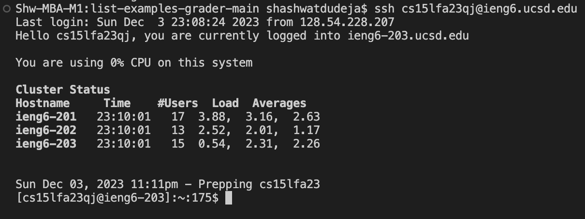
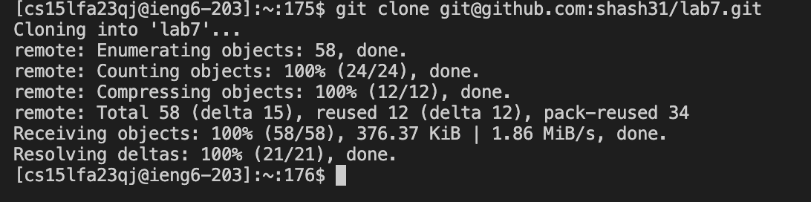
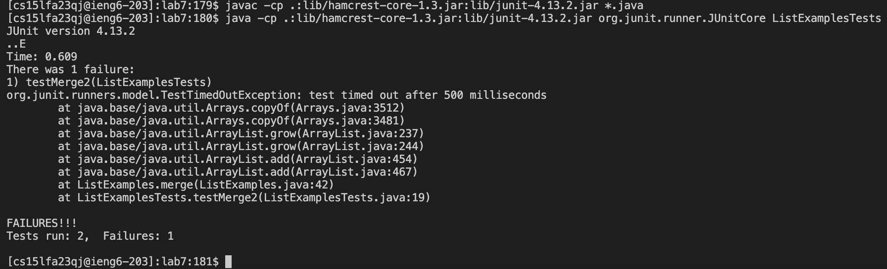
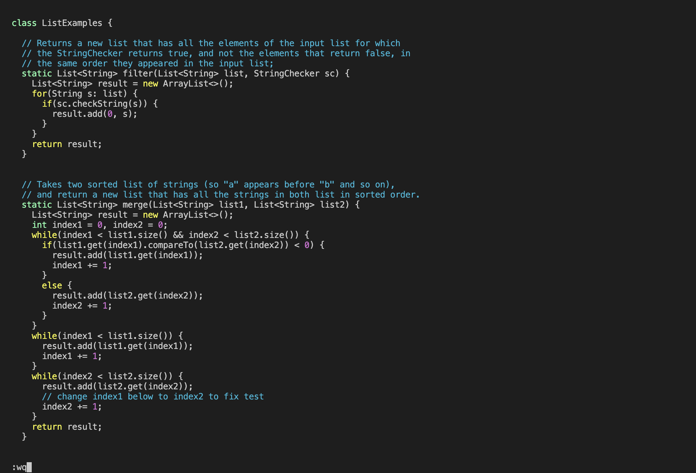
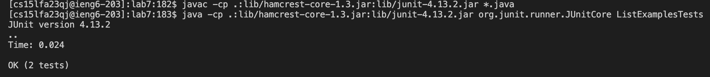
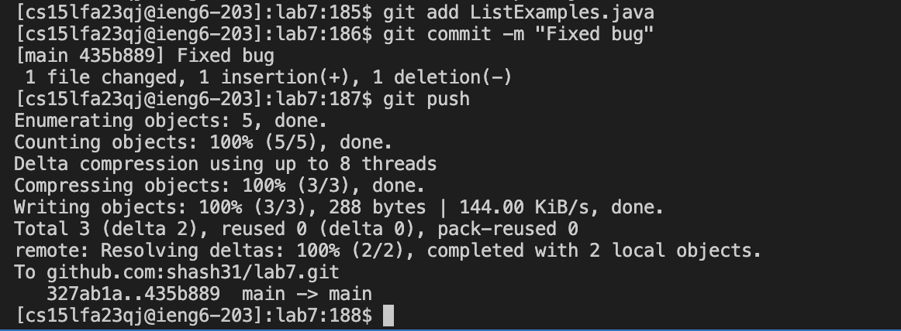

---
# Lab Report 4: Vim
---

**Steps:**
1. Log into ieng6
2. Clone your fork of the repository from your Github account (using the SSH URL)
3. Run the tests, demonstrating that they fail
4. Edit the code file to fix the failing test
5. Run the tests, demonstrating that they now succeed
6. Commit and push the resulting change to your Github account

---

> Logging into ieng6



**Keypresses:** *```<up><enter>```*

The ssh command was only 1 up in my terminal history so in order to complete this as quick as possible, I simply just had to press up and enter


> Cloning fork of repository from Github account (using SSH URL)



**Keypresses:** git```<space>```clone```<space>``` ```<cmd+v><enter>```

The github ssh link was copied on my clipboard from the fork on my github account. So I simply had to type git clone and then paste(Cmd+V) and enter


**Keypresses:** cd```<space>```lab7

I could not figure out a quicker way to complete this step but the keypresses are still not that many so it's okay

> Initially running JUnit tests



**Keypresses:** ```<up><up><up><up><enter><up><up><up><up><space>```ListExamplesTests```<enter>```

The java compiling and the junit commands were 4 up in my terminal history on the ieng6 account. So I just pressed up four times to scroll through my history and reuse those commands instead of typing all of them.

> Editing code to fix bug



**Keypresses:** vim```<space>```ListExamples.java```<enter>```Gkkkkkk1er2:wq```<enter>```

Now to edit the code, I first enter the ListExamples.java in vim. I press capital G to get to the end of the file as the index2 line in question is much closer to the end of the file. Then, I press k 6 times to go up six lines to get to the line with the bug. Then I use 1e to get to the end of one word in front of the cursor. This brings the cursor to the 1 in index1. Then I pressed r to go in replace mode and then typed 2. Now I save and exit the file with :wq and enter.

> Running JUnit tests again



**Keypresses:** ```<up><up><up><enter><up><up><up><enter>```

This time, the commands to run the JUnit tests are only 3 up in my terminal history so I only have to press up 3 times and then enter. 
Now the JUnit tests are successful as we have fixed the bug

> Committing and pushing fixed code to Github



**Keypresses:** git```<space>```add```<space>```ListExamples.java```<enter>```git```<space>```commit```<space>```-m```<space>```"Fixed bug"```<enter>```git```<space>```push```<enter>```

Now we first do git add to take a snapshot of the ListExamples file we just modified. Then we commit this change with git commit with the message "Fixed bug". And finally, we push this change onto our github repository with git push


